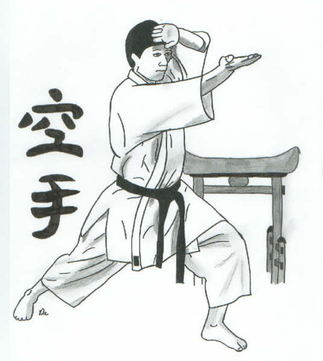

<p align="center">
  
</p>

# 🥋 Katas de Codewars – Prácticas de Programación

Este repositorio recopila mis soluciones personales a diferentes **Katas de [Codewars](https://www.codewars.com/)**.
El objetivo es practicar la lógica, la resolución de problemas y mejorar mis habilidades de programación, especialmente en **Java** (aunque a veces también uso otros lenguajes).

---


## 💡 Contenido de Cada Kata

Cada archivo incluye:

* El **link** del problema.
* Mi **solución implementada** en Java.
* (Opcional) Alternativas o mejoras de rendimiento.
* Comentarios explicativos paso a paso.

---

## 🧠 Objetivos del Repositorio

* Practicar estructuras de control, arrays, bucles y recursividad.
* Aplicar principios de **Clean Code**.
* Analizar la **complejidad algorítmica** de las soluciones.
* Mejorar la legibilidad y eficiencia del código.
* Documentar el progreso en la plataforma Codewars.

---

## 🚀 Tecnologías y Herramientas

* **Lenguaje principal:** Java ☕
* **Editor:** Visual Studio Code o IntelliJ IDEA (Tomeu nos obliga a aprender ambas)
* **Plataforma de retos:** [Codewars](https://www.codewars.com/users/TU_USUARIO)
* **Control de versiones:** Git + GitHub

---

## 📊 Niveles de Dificultad

|    Nivel   | Descripción                     | Dificultad aproximada |
| :--------: | :------------------------------ | :-------------------: |
| 🥇 1-3 kyu | Katas muy difíciles (avanzadas) |       🔥🔥🔥🔥🔥      |
| 🥈 4-6 kyu | Katas intermedias               |         🔥🔥🔥        |
| 🥉 7-8 kyu | Katas básicas o de iniciación   |           🔥          |

---

## 🧩 Cómo ejecutar los ejercicios

1. Clona el repositorio:

   ```bash
   git clone https://github.com/TU_USUARIO/codewars-katas.git
   ```
2. Compila el archivo Java:

   ```bash
   javac NombreDeLaKata.java
   ```
3. Ejecútalo:

   ```bash
   java NumeroDeKata
   ```

---

## 🏅 Perfil de Codewars

👤 **Usuario:** [AlexBest](https://www.codewars.com/users/AlexBest)
📈 **Rango actual:** *5 kyu*
💬 “El código limpio es una forma de arte.”
